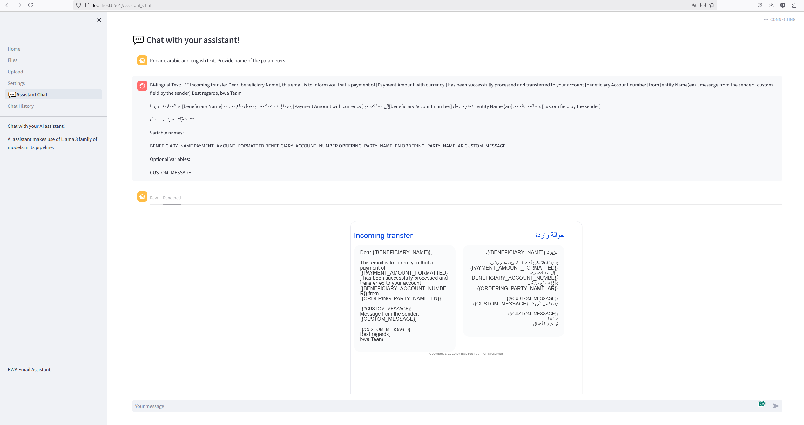

# Email Template Assistant

This AI assistant is created to assist developers create bi-lingual email templates. Target languages are arabic and english but can be extended.



## Installation

### Python Installation

Go to [Official Python Downloads Page](https://www.python.org/downloads/).

### Installing Local Assistant

Use install scripts provided for your platform e.g. windows, linux.

For linux environment you may need to give execute permission to the scripts.

```bash
chmod +x install-linux.sh
```

### Configuration

Configuration file is `config/config.yml`. Edit it to configure options like models, database, etc.

Prompts are `config/prompts.yml` file. You may edit the file for providing your own prompts.

### Launching  Assistant

Use launch script provided for your platform e.g. windows, linux.

For linux environment you may need to give execute permission to the scripts.

```bash
chmod +x launch-linux.sh
```

## Using Assistant

Open chat screen at [Assistant Chat](http://localhost:8501/Assistant_Chat).

## Provide Feedback

If you encounter an issue feel free to report by opening a GitHub issue.
